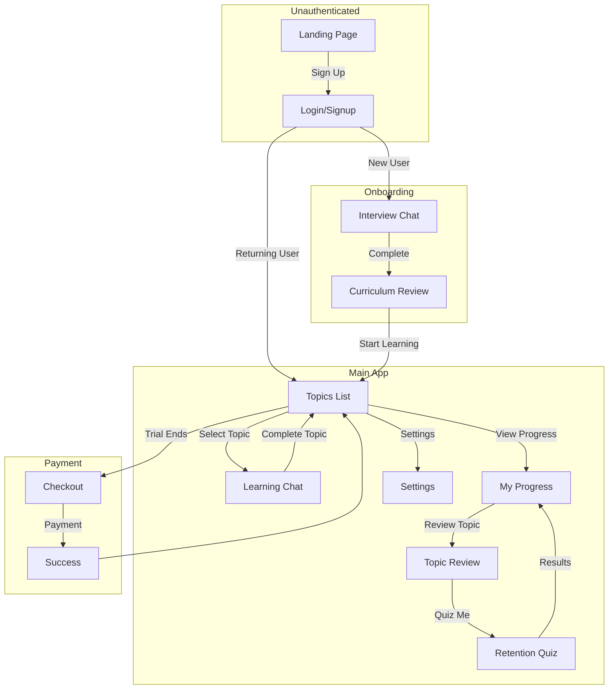
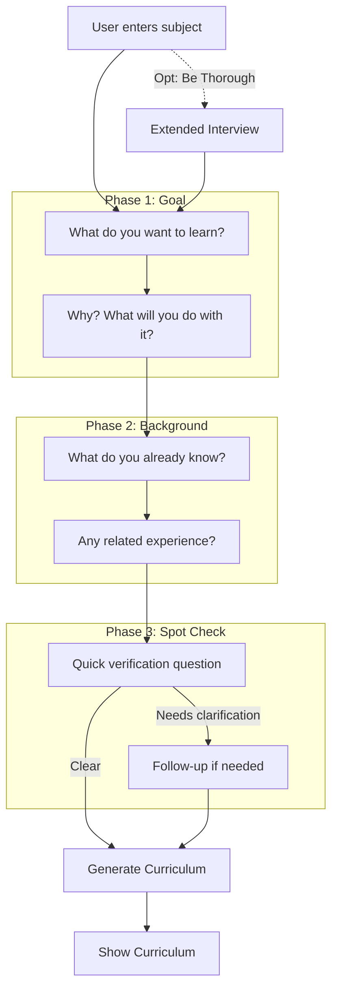
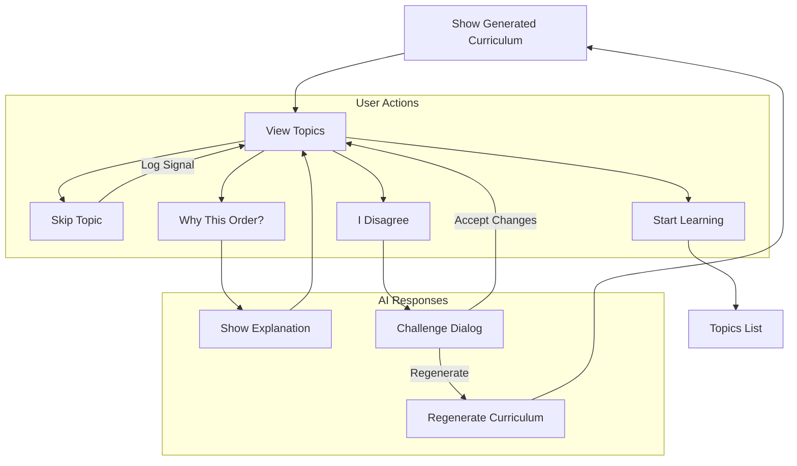
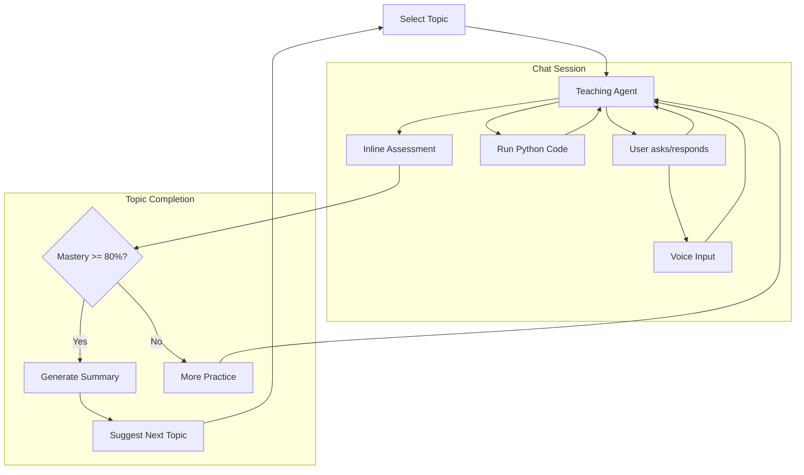
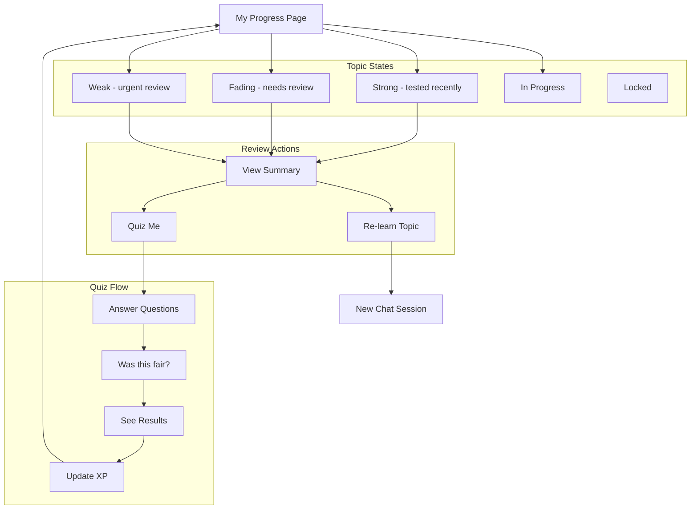
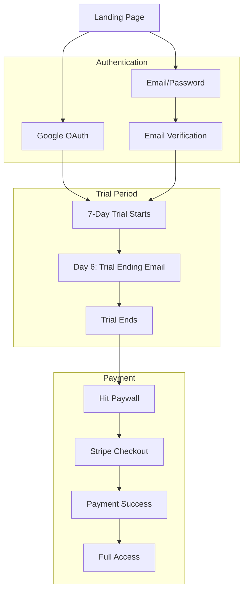
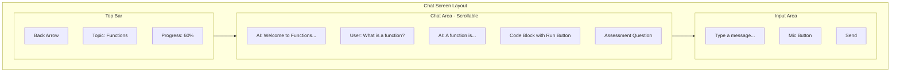
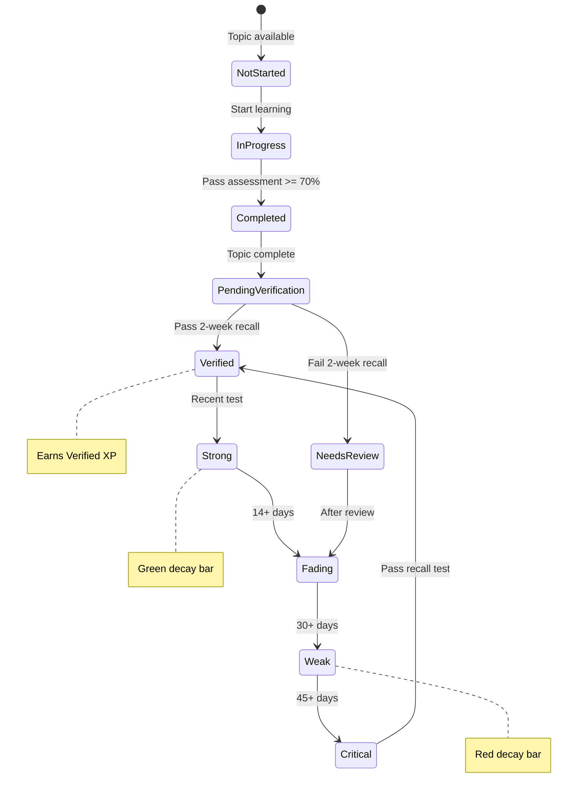

# EduAgent Pre-MVP Prototype

> **Document Status:** Planning  
> **Version:** 1.4  
> **Last Updated:** 2024-12-10  
> **Timeline:** 4 weeks build + 10 weeks validation

---

## Purpose

This document defines a minimal prototype to validate core assumptions before committing to full MVP development. The goal is to answer four critical questions with real data:

1. **Do users actually learn?** (Measurable outcomes)
2. **Will serious learners tolerate difficulty?** (Retention despite friction)
3. **Will they pay $25/month?** (Unit economics)
4. **Will they tell others?** (Organic growth potential)

If we cannot validate these with 150-200 users over 12 weeks, we should not build the full MVP.

---

## Table of Contents

1. [Philosophy](#philosophy)
2. [What We Build](#what-we-build)
3. [What We Cut](#what-we-cut)
4. [Technical Specification](#technical-specification)
5. [Validation Metrics](#validation-metrics)
6. [User Acquisition Plan](#user-acquisition-plan)
7. [Timeline](#timeline)
8. [Success Criteria](#success-criteria)
9. [Decision Framework](#decision-framework)

---

## Philosophy

```
┌─────────────────────────────────────────────────────────────────┐
│  PRE-MVP MANTRA                                                  │
├─────────────────────────────────────────────────────────────────┤
│                                                                  │
│  "Build the minimum needed to test if serious learners exist,   │
│   will pay, and actually learn. Nothing more."                  │
│                                                                  │
│  This is a VALIDATION TOOL, not a product.                      │
│                                                                  │
└─────────────────────────────────────────────────────────────────┘
```

### Core Assumptions to Validate

| Assumption | Risk if Wrong | How We Test |
|------------|---------------|-------------|
| Delayed assessment measures real learning | We can't prove outcomes | 2-week and 6-week recall emails |
| "Serious learners" segment exists | No market | Track retention after hard sessions |
| $25/month is viable | Unit economics fail | Charge from day one, no free tier |
| Pedagogy beats gamification for this segment | Wrong positioning | Qualitative feedback + retention |
| Learner model creates switching cost | No moat | Track returning users' improvement |

### What This Phase Is NOT

- Not a product launch
- Not scalable architecture
- Not multi-platform
- Not content-complete

### What This Phase MUST BE

- **Professional appearance** — Users must believe this is a real product
- **Polished UX** — Core flow must feel complete, not experimental
- **Confident copy** — No "beta", "testing", or apologetic language
- **Real branding** — Custom domain, logo, consistent design

---

## What We Build

### Core Experience (Must Have)

```
┌─────────────────────────────────────────────────────────────────┐
│  PROTOTYPE USER JOURNEY                                          │
├─────────────────────────────────────────────────────────────────┤
│                                                                  │
│  1. SIGNUP & INTERVIEW (3-5 min)                                 │
│     ├── Email or Google auth                                     │
│     ├── "What do you want to learn?" (ANY subject)               │
│     ├── Interview Agent conversation:                            │
│     │   • Goal: "Why do you want to learn this?"                 │
│     │   • Background: "What do you already know?"                │
│     │   • Spot check: 1-2 quick verification questions           │
│     ├── [Optional] "I want to be thorough" → deeper interview    │
│     └── AI generates personalized curriculum (Module 1 + preview)│
│                                                                  │
│  2. CURRICULUM REVIEW (1 min)                                    │
│     ├── Show "Your Learning Path" with generated topics          │
│     ├── User can skip topics they already know                   │
│     ├── "Why this order?" button → AI explains                   │
│     ├── "I disagree" → AI readjusts based on feedback            │
│     └── Confidence badges: [Core] [Contemporary] [Emerging]      │
│                                                                  │
│  3. LEARNING (15-20 min sessions)                                │
│     ├── Chat with Teaching Agent (type OR voice)                 │
│     ├── Voice input via OpenAI Whisper                           │
│     ├── MODE TOGGLE: [Teach Me] [Quiz Me] [Quick Answer]         │
│     │   • Teach Me: Full explanations + worked examples          │
│     │   • Quiz Me: Jump straight to testing                      │
│     │   • Quick Answer: Just answer my question, no pedagogy     │
│     ├── Agent teaches then assesses inline                       │
│     ├── "43% of learners needed extra practice here" signals     │
│     ├── Mastery gate: can't advance until 80%+                   │
│     ├── Progressive curriculum: Module 2 generated after Module 1│
│     └── Curriculum adapts based on struggles and interests       │
│                                                                  │
│  4. DELAYED ASSESSMENT (async)                                   │
│     ├── Email at 2 weeks: "Quick recall check"                   │
│     ├── 5 free-recall questions                                  │
│     ├── Score tracked, compared to inline score                  │
│     └── Email at 6 weeks: same pattern                           │
│                                                                  │
│  5. PAYMENT                                                      │
│     ├── 7-day full access trial                                  │
│     ├── Day 6: "Trial ending" email with learning stats          │
│     └── $25 one-time (not subscription for prototype)            │
│                                                                  │
│  6. VALUE RATING (after 5 consecutive days)                      │
│     ├── Single pop-up, one question only                         │
│     ├── "How would you rate the learning value                   │
│     │    you're getting for your money?"                         │
│     ├── (1-5 stars)                                              │
│     └── Dismiss and never show again                             │
│                                                                  │
│  7. REVIEW & RE-LEARN (anytime)                                  │
│     ├── "My Progress" page shows completed topics                │
│     ├── Each topic shows decay status (Strong → Weak)            │
│     ├── [Review] shows summary + key concepts                    │
│     ├── [Quiz Me] generates retention test                       │
│     └── [Re-learn] starts fresh lesson with prior context        │
│                                                                  │
└─────────────────────────────────────────────────────────────────┘
```

### Interview Flow (Dynamic Curriculum)

**Any subject, any level.** The AI generates a personalized curriculum based on a conversational interview.

```
┌─────────────────────────────────────────────────────────────────┐
│  INTERVIEW AGENT (3 min default, 5-7 min thorough)               │
├─────────────────────────────────────────────────────────────────┤
│                                                                  │
│  USER: "I want to learn machine learning"                        │
│                                                                  │
│  AI: "Great choice! A few questions to personalize your path:"  │
│                                                                  │
│  PHASE 1: Goal Understanding                                     │
│  AI: "What will you do with ML knowledge?                        │
│       (hobby project, job requirement, academic interest...)"    │
│  USER: "I want to build recommendation systems for my startup"   │
│                                                                  │
│  PHASE 2: Background Probe                                       │
│  AI: "What's your background with math and programming?"         │
│  USER: "I have a CS degree but it was 5 years ago"               │
│  AI: "Do you remember linear algebra? Matrix multiplication?"    │
│  USER: "Vaguely..."                                              │
│                                                                  │
│  PHASE 3: Spot Check (1-2 verification questions)                │
│  AI: "Quick check - what's a dot product of two vectors?"        │
│  USER: "Uh... multiply them together somehow?"                   │
│  AI: "Got it. I'll include a refresher on that."                 │
│                                                                  │
│  AI: "Thanks! Generating your personalized learning path..."     │
│                                                                  │
└─────────────────────────────────────────────────────────────────┘
                              │
                              ▼
┌─────────────────────────────────────────────────────────────────┐
│  CURRICULUM GENERATION (Path Agent)                              │
├─────────────────────────────────────────────────────────────────┤
│                                                                  │
│  Based on interview_summary:                                     │
│  • Goal: Recommendation systems (professional)                   │
│  • Verified level: Beginner-intermediate (CS degree, rusty math) │
│  • Gaps: Linear algebra, probability                             │
│  • Time: 5 hours/week                                            │
│                                                                  │
│  Generate Module 1 in detail (5-8 topics)                        │
│  Generate Module 2-3 as preview (titles only)                    │
│                                                                  │
│  Source constraints:                                             │
│  ✓ University syllabi, textbooks, peer-reviewed                  │
│  ✗ No blog posts, no trendy approaches, no invented frameworks   │
│                                                                  │
└─────────────────────────────────────────────────────────────────┘
```

### Curriculum Visibility UI

User sees their generated curriculum and can interact with it:

```
┌─────────────────────────────────────────────────────────────────┐
│  YOUR LEARNING PATH: Machine Learning for Recommendations        │
│  Based on your goals and background                              │
├─────────────────────────────────────────────────────────────────┤
│                                                                  │
│  MODULE 1: Mathematical Foundations                              │
│  ┌────────────────────────────────────────────────────────────┐ │
│  │  ○ Probability Fundamentals      ~45 min   [Core]   [Skip] │ │
│  │    "After this, you can calculate conditional probability"  │ │
│  │                                                             │ │
│  │  ○ Linear Algebra Refresher      ~60 min   [Core]   [Skip] │ │
│  │    "After this, you can perform matrix operations"          │ │
│  │                                                             │ │
│  │  ○ Gradient Descent Basics       ~40 min   [Core]          │ │
│  │    "After this, you can understand how ML models learn"     │ │
│  │                                                             │ │
│  │  ○ Python for ML                 ~30 min   [Core]   [Skip] │ │
│  │    "After this, you can use NumPy and Pandas basics"        │ │
│  └────────────────────────────────────────────────────────────┘ │
│                                                                  │
│  MODULE 2: Supervised Learning (PREVIEW)                         │
│  │  ○ Linear Regression                                        │ │
│  │  ○ Logistic Regression                                      │ │
│  │  ○ Model Evaluation                                         │ │
│  │  (Details generated after Module 1)                         │ │
│                                                                  │
│  MODULE 3: Recommendation Systems (PREVIEW)                      │
│  │  ○ Collaborative Filtering                                  │ │
│  │  ○ Content-Based Filtering                                  │ │
│  │  ○ Hybrid Approaches                                        │ │
│                                                                  │
│  ─────────────────────────────────────────────────────────────  │
│                                                                  │
│  [Why this order?]  [I disagree]  [Start Learning]               │
│                                                                  │
└─────────────────────────────────────────────────────────────────┘
```

**"Why this order?" Response:**

```
┌─────────────────────────────────────────────────────────────────┐
│  Why this order?                                                 │
├─────────────────────────────────────────────────────────────────┤
│                                                                  │
│  Good question! Here's my reasoning:                             │
│                                                                  │
│  1. Probability before ML because:                               │
│     → ML relies heavily on probabilistic concepts                │
│     → Your spot check showed this is a gap for you               │
│                                                                  │
│  2. Linear Algebra before Gradient Descent because:              │
│     → Gradient descent uses matrix operations                    │
│     → Can't optimize without understanding dimensions            │
│                                                                  │
│  3. Python basics early because:                                 │
│     → All our examples use Python                                │
│     → Better to be comfortable before diving deep                │
│                                                                  │
│  This follows standard university sequencing for ML courses.     │
│                                                                  │
│  [Got it, continue]  [I still disagree]                          │
│                                                                  │
└─────────────────────────────────────────────────────────────────┘
```

**"I disagree" Flow:**

```
┌─────────────────────────────────────────────────────────────────┐
│  What would you change?                                          │
├─────────────────────────────────────────────────────────────────┤
│                                                                  │
│  USER: "I already know Python well, and I'd rather jump         │
│         straight to the ML concepts. The math can come later."   │
│                                                                  │
│  AI: "I understand — you want to get to the interesting stuff!  │
│                                                                  │
│       I can adjust, but I'd suggest keeping probability early   │
│       because recommendation systems are very probabilistic.     │
│                                                                  │
│       How about this revised order:                              │
│       1. Python for ML (quick — you'll breeze through)          │
│       2. What is ML? (fun intro)                                │
│       3. Probability (essential, but we'll move faster)          │
│       4. Collaborative Filtering basics                          │
│       5. Linear algebra (just-in-time, when needed)              │
│                                                                  │
│       Does that work better for you?"                            │
│                                                                  │
│  [Yes, use this order]  [Let me explain more]                    │
│                                                                  │
└─────────────────────────────────────────────────────────────────┘
```

**Confidence Badges:**

| Badge | Meaning | Display |
|-------|---------|---------|
| `[Core]` | Standard in any curriculum for this subject | Dark, solid |
| `[Recommended]` | Commonly taught, widely accepted | Medium |
| `[Contemporary]` | Modern topic, may evolve | Light, italic |
| `[Emerging]` | Cutting-edge, optional | Dashed border |

### Learning Book (Review Flow)

Users can access their "Learning Book" to review past topics:

```
┌─────────────────────────────────────────────────────────────────┐
│  📚 MY PROGRESS                                                  │
├─────────────────────────────────────────────────────────────────┤
│                                                                  │
│  Python Fundamentals                              4/10 topics   │
│                                                                  │
│  ├── ✓ Variables & Types     ████████░░ Strong    [Review]      │
│  ├── ✓ Control Flow          █████░░░░░ Fading    [Review]      │
│  ├── ✓ Functions             ██░░░░░░░░ Weak ⚠️   [Review]      │
│  ├── ✓ Lists                 ███████░░░ Good      [Review]      │
│  ├── → Dictionaries          In Progress...                     │
│  └── 🔒 Classes              Locked                             │
│                                                                  │
│  ─────────────────────────────────────────────────────────────  │
│  ⚠️ 2 topics need review                    [Review Weakest]    │
│                                                                  │
└─────────────────────────────────────────────────────────────────┘
```

**Review Page (when user clicks [Review]):**

```
┌─────────────────────────────────────────────────────────────────┐
│  📖 Functions                                                    │
│  Learned 5 days ago • Retention: Weak (40%)                      │
├─────────────────────────────────────────────────────────────────┤
│                                                                  │
│  KEY CONCEPTS                                                    │
│  • def function_name(parameters):                               │
│  • Return sends value back to caller                            │
│  • Default parameters with name="value"                         │
│  • Difference between return and print                          │
│                                                                  │
│  EXAMPLES WE COVERED                                             │
│  • Calculator functions (add, subtract)                         │
│  • Recipe analogy: function = recipe, parameters = ingredients  │
│                                                                  │
│  YOUR NOTES                                                      │
│  "You found return vs print confusing at first.                 │
│   The calculator example helped clarify."                        │
│                                                                  │
│  ─────────────────────────────────────────────────────────────  │
│                                                                  │
│  [Quiz Me]              [Re-learn]              [← Back]        │
│                                                                  │
└─────────────────────────────────────────────────────────────────┘
```

**Quiz Flow (step-level feedback):**

Questions always ask for reasoning, not just answers:

```
┌─────────────────────────────────────────────────────────────────┐
│  🧠 QUIZ: Functions                    Question 1 of 3          │
├─────────────────────────────────────────────────────────────────┤
│                                                                  │
│  Write a function that takes a list of numbers                  │
│  and returns only the even ones.                                │
│                                                                  │
│  Walk me through your approach.                                 │
│                                                                  │
│  ┌─────────────────────────────────────────────────────────────┐│
│  │ def get_evens(numbers):                                     ││
│  │     return [n for n in numbers if n % 2 == 0]               ││
│  │                                                             ││
│  └─────────────────────────────────────────────────────────────┘│
│                                                                  │
│  Explain your reasoning (voice or text):                        │
│  ┌─────────────────────────────────────────────────────────────┐│
│  │ I used a list comprehension to filter. The modulo           ││
│  │ operator checks if the number is divisible by 2.            ││
│  └─────────────────────────────────────────────────────────────┘│
│                                                                  │
│  [▶ Run Code]          [Submit Answer]          [🎤 Voice]      │
│                                                                  │
│  ─────────────────────────────────────────────────────────────  │
│  Was this question fair?  [Yes] [No]                            │
│                                                                  │
└─────────────────────────────────────────────────────────────────┘
```

**Step-Level Feedback (correct):**

```
┌─────────────────────────────────────────────────────────────────┐
│  ✓ Great reasoning!                                             │
├─────────────────────────────────────────────────────────────────┤
│                                                                  │
│  Steps evaluated:                                                │
│  ✓ Chose list comprehension (appropriate tool)                  │
│  ✓ Used modulo operator correctly                               │
│  ✓ Explained why n % 2 == 0 means even                          │
│                                                                  │
│  Your understanding is solid!                    [Next →]       │
│                                                                  │
└─────────────────────────────────────────────────────────────────┘
```

**Step-Level Feedback (error found):**

```
┌─────────────────────────────────────────────────────────────────┐
│  ⚠️ Let's look at your reasoning                                 │
├─────────────────────────────────────────────────────────────────┤
│                                                                  │
│  Steps evaluated:                                                │
│  ✓ Identified need to filter the list                           │
│  ✗ "I used print to output the result"                          │
│                                                                  │
│  You correctly identified we need to filter. But check your     │
│  return statement — what's the difference between return        │
│  and print when the function is called from other code?         │
│                                                                  │
│  [Try Again]              [Explain the Difference]              │
│                                                                  │
└─────────────────────────────────────────────────────────────────┘
```

**Quiz Results:**

```
┌─────────────────────────────────────────────────────────────────┐
│  ✅ QUIZ COMPLETE                                                │
├─────────────────────────────────────────────────────────────────┤
│                                                                  │
│  Score: 2/3 questions (67%)                                     │
│  Step accuracy: 7/9 steps (78%)                                 │
│  Retention updated: Weak (40%) → Fading (55%)                   │
│                                                                  │
│  XP Earned: +30 verified XP                                     │
│  Honest Streak: 5 days                                          │
│                                                                  │
│  ─────────────────────────────────────────────────────────────  │
│  Pattern detected: return vs print confusion                    │
│  (Added to your learner model for follow-up)                    │
│                                                                  │
│  [Re-learn This Topic]        [Continue Learning →]             │
│                                                                  │
└─────────────────────────────────────────────────────────────────┘
```

### Outcome-Based Gamification

**Philosophy:** Reward what actually matters — knowledge retention, not app opens.

```
┌─────────────────────────────────────────────────────────────────┐
│  GAMIFICATION: OUTCOMES, NOT INPUTS                              │
├─────────────────────────────────────────────────────────────────┤
│                                                                  │
│  1. RETENTION XP (not completion XP)                            │
│     ├── Complete topic → 0 XP (pending verification)            │
│     ├── Pass 2-week recall → +30 XP                             │
│     ├── Pass 6-week recall → +50 XP                             │
│     └── Fail recall → XP decays                                 │
│                                                                  │
│     User sees: "20 topics completed, 12 verified"               │
│                                                                  │
│  2. KNOWLEDGE HALF-LIFE (visual decay)                          │
│     ├── Progress bars that fade over time                       │
│     ├── Strong (tested 3d ago) → Weak (tested 30d ago)         │
│     ├── Creates REAL urgency (knowledge IS decaying)            │
│     └── [Review Weakest] button                                 │
│                                                                  │
│  3. HONEST STREAK                                               │
│     ├── Only counts days where you PASSED a recall              │
│     ├── NOT days you opened the app                             │
│     └── Streak "pauses" for 3 days (not instant break)          │
│                                                                  │
└─────────────────────────────────────────────────────────────────┘
```

**Softer Defaults (Avoid Anxiety):**

The Finnish model teaches us: low stress = better learning. We balance honest feedback with positive framing:

| Potentially Anxious | Softer Alternative |
|---------------------|-------------------|
| "Almost gone" | "Ready for a quick review" |
| XP decays automatically | XP decays only on FAILED recall (not skipped) |
| Streak breaks instantly | Streak pauses for 3 days — can resume |
| 80% mastery gate | 70% to proceed, 80% for "verified" badge |
| "You forgot this" | "Let's refresh this together" |

**Prototype Validation:** We test if users WANT the harder mode. If retention is better with softer defaults, we use those.

**Knowledge Half-Life Dashboard:**

```
┌─────────────────────────────────────────┐
│  YOUR PYTHON KNOWLEDGE                   │
├─────────────────────────────────────────┤
│                                          │
│  ████████████████████░░░░  Functions     │  Strong (3 days ago)
│  ██████████████░░░░░░░░░░  Loops         │  Fading (12 days ago)
│  ████████░░░░░░░░░░░░░░░░  Lists         │  Weak (25 days ago)
│  ██░░░░░░░░░░░░░░░░░░░░░░  Variables     │  Almost gone (40 days ago)
│                                          │
│  [Review Weakest] [Test Yourself]        │
│                                          │
│  Verified XP: 280  │  Pending: 160       │
│  Honest Streak: 12 days                  │
│                                          │
└─────────────────────────────────────────┘
```

### Minimal Learner Model

Track just enough to test personalization value:

```python
learner_model = {
    "user_id": "uuid",
    
    # What explanations worked?
    "effective_explanations": [
        {"topic": "loops", "type": "code_first", "assessment_score": 0.9},
        {"topic": "functions", "type": "analogy", "assessment_score": 0.85}
    ],
    
    # What do they get wrong?
    "misconceptions": [
        {"concept": "scope", "confused_with": "global_variables", "frequency": 3},
    ],
    
    # Struggle patterns
    "struggle_signals": {
        "avg_response_time_when_confused": 45,  # seconds
        "phrases_indicating_confusion": ["I think maybe", "not sure"]
    }
}
```

### Single Teaching Agent

One agent handles teaching + assessment (no orchestrator overhead):

```
== TEACHING AGENT (Prototype) ==

You are a Python tutor using evidence-based pedagogy.

CORE PRINCIPLES (non-negotiable):
1. TESTING IS THE TEACHING - 70% testing, 30% explaining (research-backed)
2. MASTERY BEFORE PROGRESS - User cannot advance without demonstrating understanding
3. RETRIEVAL PRACTICE - Test recall, don't just re-explain
4. DESIRABLE DIFFICULTY - Struggle is learning, don't make it too easy
5. STEP-LEVEL FEEDBACK - Diagnose WHY they're wrong, not just THAT they're wrong
6. COGNITIVE LOAD MANAGEMENT - ONE concept per message, check understanding before continuing

WRONG PATTERN: Explain → Explain → Explain → Test
RIGHT PATTERN: Brief intro → Test → Targeted teach → Test → Test

== DEFAULT MODE IS TESTING ==
Start with a question to gauge what they know.
Only explain when:
- They answer incorrectly
- They ask "what is X?" or "explain Y"
- They say they're confused

Even then, explain BRIEFLY and return to testing.

== EVERY RESPONSE ENDS WITH A QUESTION ==
No exceptions. If it doesn't end with "?" — rewrite it.

WRONG: "Functions let you reuse code. You define them with `def`."
RIGHT: "Functions let you reuse code. You define them with `def`.
        How would you call a function named `greet`?"

== CURRENT TOPIC ==
{topic_title}
{topic_learning_objectives}

== MODE (User-Selected) ==
Current mode: {learning_mode}

TEACH ME mode:
  - Full explanations with worked examples
  - Default mode for new concepts
  - Use fading based on mastery

QUIZ ME mode:
  - Skip explanations, go straight to questions
  - Only explain if they get it wrong
  - Good for returning users

QUICK ANSWER mode:
  - Answer their question directly
  - No pedagogy, just information
  - Treat like ChatGPT, not a tutor
  - After answering: "Want to dive deeper on this, or move on?"

== LEARNER CONTEXT ==
Prior topics completed: {completed_topics}
Known misconceptions: {misconceptions}
Explanation types that worked: {effective_explanations}
Current struggle probability: {struggle_score}
Others who struggled here: {struggle_percentage}%  -- mention if > 30%

== COGNITIVE LOAD RULES ==
- ONE concept per message, max TWO if tightly related
- After introducing a concept, STOP and check understanding
- If writing "also," "additionally," "another thing" — STOP
- Complex topics = multi-turn disclosure, never dump everything at once

== WORKED EXAMPLES (d=0.57 — Use for Novices) ==

For NEW concepts or struggling learners, show the PROCESS, not just the answer.

WRONG (just the answer):
  "The derivative of x² is 2x. What's the derivative of x³?"

RIGHT (worked example):
  "Let me show you how to find the derivative of x².
   Step 1: Identify the exponent → 2
   Step 2: Bring it down as coefficient → 2·x²
   Step 3: Reduce exponent by 1 → 2·x¹ = 2x
   
   Now walk me through x³ using these same steps."

FADING: As mastery increases, fade examples:
- Low mastery: Full worked example → explain back → similar problem
- Medium mastery: Partial example (first steps only) → they complete
- High mastery: Problem first → example only if they struggle

== SESSION FLOW ==
1. If new topic: Brief explanation (2-4 sentences, ONE concept)
2. EXPLAIN BACK (critical for learning):
   "Before we continue, explain [concept] back to me in your own words."
   - This reveals true understanding better than "Do you understand?"
   - Analyze their explanation for gaps and misconceptions
3. Based on their explanation:
   - Complete + accurate → Move to NEXT concept (not all remaining concepts)
   - Partial gaps → Fill specific gaps, then re-check
   - Misconception revealed → Address it directly, re-teach differently
4. Repeat for each concept in the topic
5. After 3-4 exchanges: Formal assessment (3 questions)
6. Mastery threshold: 80%+ to complete topic

== ASSESSMENT MODE ==
When assessing:
- Use FREE RECALL, not multiple choice
- Ask them to write code or explain in their own words
- Evaluate for understanding, not keywords

When they get something wrong:
- Classify: CONCEPTUAL / PROCEDURAL / PREREQUISITE / CARELESS
- If CONCEPTUAL: Note misconception, explain the specific confusion
- If PREREQUISITE: Flag gap, suggest review
- If CARELESS: Brief correction, continue

== ASSESSMENT VALIDATION (Quality Control) ==
After EVERY assessment question, user sees:
  [Was this question fair?] → Yes / No

If "No":
- Question is NOT counted against mastery score
- Logged for human review
- User continues without penalty

This catches:
- Ambiguous questions
- Questions about untaught content
- AI-generated errors
- Cultural/language misunderstandings

If >5% of users flag same question pattern → Admin alert

== OUTPUT METADATA ==
End every response with:
|||META|||
{
  "mode": "teaching|assessment|feedback",
  "mastery_estimate": 0.0-1.0,
  "misconception": "string|null",
  "explanation_type": "code_first|analogy|formal|visual_description",
  "error_type": "conceptual|procedural|prerequisite|careless|null",
  "topic_complete": false
}
```

### Response Validation (Testing is Teaching Enforcement)

Backend validates every AI response before sending to user:

```typescript
// lib/validation/teaching-response.ts

export function validateEndsWithQuestion(response: string): boolean {
  const lines = response.trim().split('\n').filter(l => l.trim());
  if (lines.length === 0) return false;
  
  let lastLine = lines[lines.length - 1];
  
  // If ends with code block, check line before
  if (lastLine.startsWith('```')) {
    for (let i = lines.length - 2; i >= 0; i--) {
      if (!lines[i].startsWith('```')) {
        lastLine = lines[i];
        break;
      }
    }
  }
  
  return lastLine.trim().endsWith('?');
}

export async function processTeachingResponse(
  response: string,
  regenerateFn: () => Promise<string>
): Promise<string> {
  if (!validateEndsWithQuestion(response)) {
    // Regenerate with stricter instruction
    return await regenerateFn();
  }
  return response;
}

// Track metrics per session
export interface TeachingMetrics {
  totalAiTurns: number;
  explainTurns: number;
  testTurns: number;
  explainRatio: number;
  regenerationsForRatio: number;
}
```

**Regeneration prompt injection:**

```typescript
const FORCE_QUESTION_PROMPT = `
== CRITICAL: YOUR RESPONSE MUST END WITH A QUESTION ==
Your previous response did not end with a question.
Rewrite to end with a question that tests understanding.
Do NOT just add "Does that make sense?" — ask a REAL question.
`;
```

### Voice Input Implementation

Users can speak instead of type. Voice is transcribed to text, then processed normally.

```
┌─────────────────────────────────────────────────────────────────┐
│  VOICE INPUT FLOW                                                │
├─────────────────────────────────────────────────────────────────┤
│                                                                  │
│  1. User taps 🎤 microphone button                               │
│  2. Browser records audio (MediaRecorder API)                    │
│  3. On release, audio sent to /api/transcribe                    │
│  4. Whisper API transcribes → returns text                       │
│  5. Text appears in input field (user can edit)                  │
│  6. User confirms → sent to Teaching Agent                       │
│                                                                  │
│  Response is TEXT only (no voice output for prototype)           │
│                                                                  │
└─────────────────────────────────────────────────────────────────┘
```

**Frontend (React component):**

```typescript
// components/VoiceInput.tsx
import { useState, useRef } from 'react';

export function VoiceInput({ onTranscript }: { onTranscript: (text: string) => void }) {
  const [isRecording, setIsRecording] = useState(false);
  const mediaRecorder = useRef<MediaRecorder | null>(null);
  const chunks = useRef<Blob[]>([]);

  const startRecording = async () => {
    const stream = await navigator.mediaDevices.getUserMedia({ audio: true });
    mediaRecorder.current = new MediaRecorder(stream);
    chunks.current = [];

    mediaRecorder.current.ondataavailable = (e) => chunks.current.push(e.data);
    mediaRecorder.current.onstop = async () => {
      const audioBlob = new Blob(chunks.current, { type: 'audio/webm' });
      const formData = new FormData();
      formData.append('audio', audioBlob, 'recording.webm');

      const res = await fetch('/api/transcribe', { method: 'POST', body: formData });
      const { text } = await res.json();
      onTranscript(text);
    };

    mediaRecorder.current.start();
    setIsRecording(true);
  };

  const stopRecording = () => {
    mediaRecorder.current?.stop();
    setIsRecording(false);
  };

  return (
    <button
      onMouseDown={startRecording}
      onMouseUp={stopRecording}
      onTouchStart={startRecording}
      onTouchEnd={stopRecording}
      className={isRecording ? 'bg-red-500' : 'bg-gray-200'}
    >
      🎤
    </button>
  );
}
```

**Backend (API route):**

```typescript
// app/api/transcribe/route.ts
import OpenAI from 'openai';

const openai = new OpenAI();

export async function POST(request: Request) {
  const formData = await request.formData();
  const audioFile = formData.get('audio') as File;

  const transcription = await openai.audio.transcriptions.create({
    file: audioFile,
    model: 'whisper-1',
  });

  return Response.json({ text: transcription.text });
}
```

**Cost:** ~$0.006/minute of audio (negligible)

### Python Code Execution (Pyodide)

**Critical:** You cannot teach Python without running code. Pyodide runs Python in the browser via WebAssembly — no server needed.

```
┌─────────────────────────────────────────────────────────────────┐
│  CODE EXECUTION FLOW                                             │
├─────────────────────────────────────────────────────────────────┤
│                                                                  │
│  1. User writes/pastes Python code in chat                       │
│  2. Agent detects code block (```python)                         │
│  3. Code runs in Pyodide (client-side)                           │
│  4. Output/errors shown inline                                   │
│  5. Agent can reference output in teaching                       │
│                                                                  │
│  SECURITY: Runs in browser sandbox, no server access             │
│  LIMITATIONS: No file I/O, network, or heavy libs                │
│  SUPPORTED: Core Python, math, basic data structures             │
│                                                                  │
└─────────────────────────────────────────────────────────────────┘
```

**Setup (install once):**

```bash
npm install pyodide
```

**Pyodide Service:**

```typescript
// lib/pyodide.ts
import { loadPyodide, PyodideInterface } from 'pyodide';

let pyodide: PyodideInterface | null = null;

export async function initPyodide(): Promise<PyodideInterface> {
  if (!pyodide) {
    pyodide = await loadPyodide({
      indexURL: 'https://cdn.jsdelivr.net/pyodide/v0.24.1/full/',
    });
  }
  return pyodide;
}

export async function runPython(code: string): Promise<{
  output: string;
  error: string | null;
  executionTime: number;
}> {
  const py = await initPyodide();
  const startTime = Date.now();
  
  // Capture stdout
  py.runPython(`
    import sys
    from io import StringIO
    sys.stdout = StringIO()
  `);
  
  try {
    const result = await py.runPythonAsync(code);
    const stdout = py.runPython('sys.stdout.getvalue()');
    
    return {
      output: stdout || String(result ?? ''),
      error: null,
      executionTime: Date.now() - startTime,
    };
  } catch (err: any) {
    return {
      output: '',
      error: err.message,
      executionTime: Date.now() - startTime,
    };
  }
}
```

**Code Block Component:**

```tsx
// components/CodeRunner.tsx
import { useState } from 'react';
import { runPython } from '@/lib/pyodide';

export function CodeRunner({ code }: { code: string }) {
  const [output, setOutput] = useState<string | null>(null);
  const [error, setError] = useState<string | null>(null);
  const [running, setRunning] = useState(false);

  const handleRun = async () => {
    setRunning(true);
    const result = await runPython(code);
    setOutput(result.output);
    setError(result.error);
    setRunning(false);
  };

  return (
    <div className="bg-gray-900 rounded-lg p-4">
      <pre className="text-green-400 mb-2">{code}</pre>
      <button 
        onClick={handleRun}
        disabled={running}
        className="bg-blue-600 px-4 py-2 rounded"
      >
        {running ? 'Running...' : '▶ Run Code'}
      </button>
      {output && (
        <pre className="mt-2 text-white bg-black p-2 rounded">
          {output}
        </pre>
      )}
      {error && (
        <pre className="mt-2 text-red-400 bg-black p-2 rounded">
          Error: {error}
        </pre>
      )}
    </div>
  );
}
```

**Agent Integration:**

When the Teaching Agent generates code, wrap it in a CodeRunner component:

```typescript
// Parse agent response for code blocks
function parseResponse(response: string) {
  const codeBlockRegex = /```python\n([\s\S]*?)```/g;
  const parts = [];
  let lastIndex = 0;
  
  for (const match of response.matchAll(codeBlockRegex)) {
    // Add text before code block
    if (match.index > lastIndex) {
      parts.push({ type: 'text', content: response.slice(lastIndex, match.index) });
    }
    // Add runnable code block
    parts.push({ type: 'code', content: match[1] });
    lastIndex = match.index + match[0].length;
  }
  
  // Add remaining text
  if (lastIndex < response.length) {
    parts.push({ type: 'text', content: response.slice(lastIndex) });
  }
  
  return parts;
}
```

**Effort:** +2 days to prototype timeline

### Gamification Logic Implementation

**Knowledge Decay Calculation:**

```typescript
// lib/knowledge-decay.ts

// Decay constant: knowledge halves roughly every 20 days without review
const DECAY_CONSTANT = 20;

export function calculateDecayLevel(lastRecallAt: Date | null): number {
  if (!lastRecallAt) return 0;
  const daysSince = differenceInDays(new Date(), lastRecallAt);
  // Exponential decay: 100% at 0 days, ~50% at 20 days, ~25% at 40 days
  return Math.max(0, 100 * Math.exp(-daysSince / DECAY_CONSTANT));
}

export function getStrengthLabel(decay: number): { label: string; color: string } {
  if (decay > 80) return { label: 'Strong', color: 'bg-green-500' };
  if (decay > 50) return { label: 'Fading', color: 'bg-yellow-500' };
  if (decay > 25) return { label: 'Weak', color: 'bg-orange-500' };
  return { label: 'Almost gone', color: 'bg-red-500' };
}
```

**Retention XP Logic:**

```typescript
// lib/retention-xp.ts

const XP_REWARDS = {
  TOPIC_COMPLETE: 0,    // No XP on completion (pending verification)
  PENDING_XP: 80,       // Max XP that can be earned from this topic
  RECALL_2WK: 30,       // XP for passing 2-week recall
  RECALL_6WK: 50,       // XP for passing 6-week recall
};

export async function onTopicComplete(userId: string, topicId: string) {
  await supabase.from('topic_progress').update({
    status: 'completed',
    pending_xp: XP_REWARDS.PENDING_XP,
    verified_xp: 0,
  }).match({ user_id: userId, topic_id: topicId });
}

export async function onRecallPass(
  userId: string, 
  topicId: string, 
  score: number, 
  recallType: '2wk' | '6wk'
) {
  const xpGain = recallType === '2wk' ? XP_REWARDS.RECALL_2WK : XP_REWARDS.RECALL_6WK;
  const column = recallType === '2wk' ? 'recall_2wk_score' : 'recall_6wk_score';
  
  // Update topic progress
  await supabase.rpc('award_verified_xp', {
    p_user_id: userId,
    p_topic_id: topicId,
    p_xp: xpGain,
    p_column: column,
    p_score: score
  });
  
  // Update honest streak
  await updateHonestStreak(userId);
  
  return { xp_earned: xpGain };
}
```

**Honest Streak Logic:**

```typescript
// lib/honest-streak.ts

export async function updateHonestStreak(userId: string) {
  const today = format(new Date(), 'yyyy-MM-dd');
  
  const { data: user } = await supabase
    .from('users')
    .select('last_recall_pass_date, honest_streak')
    .eq('id', userId)
    .single();
  
  if (user.last_recall_pass_date === today) return; // Already counted
  
  const yesterday = format(subDays(new Date(), 1), 'yyyy-MM-dd');
  const newStreak = user.last_recall_pass_date === yesterday 
    ? user.honest_streak + 1 
    : 1;
  
  await supabase.from('users').update({
    honest_streak: newStreak,
    last_recall_pass_date: today,
  }).eq('id', userId);
}
```

**Knowledge Dashboard API:**

```typescript
// app/api/knowledge/route.ts

export async function GET(request: Request) {
  const user = await getUser(request);
  
  const { data: topics } = await supabase
    .from('topic_progress')
    .select('*, topics(*)')
    .eq('user_id', user.id)
    .eq('status', 'completed');
  
  const { data: userData } = await supabase
    .from('users')
    .select('verified_xp, pending_xp, honest_streak')
    .eq('id', user.id)
    .single();
  
  return Response.json({
    topics: topics.map(t => ({
      ...t,
      decay_level: calculateDecayLevel(t.last_recall_at),
      strength: getStrengthLabel(calculateDecayLevel(t.last_recall_at)),
    })),
    verified_xp: userData.verified_xp,
    pending_xp: userData.pending_xp,
    honest_streak: userData.honest_streak,
  });
}
```

---

## What We Cut

### From Full MVP → Prototype

| Full MVP | Prototype | Rationale |
|----------|-----------|-----------|
| iOS + Android + Web | Web only | Faster build, easier iteration |
| Expo/React Native | Next.js | Simpler, faster development |
| 5 LangGraph agents | 1 agent | Complexity doesn't help validation |
| WebSocket streaming | HTTP + fake typing | Good enough for testing |
| Stripe subscriptions | Stripe Checkout (one-time) | Validates willingness to pay |
| Pre-seeded curriculum | AI-generated per user | Dynamic curriculum is core value prop |
| PostgreSQL + Redis | Supabase only | Simplicity |
| Push notifications | Email only | Sufficient for delayed assessment |
| Full gamification | Outcome-based only | Retention XP, decay bars, honest streak |
| Full onboarding | 3-min interview | Quick + personalized |
| Dark mode | No | Polish isn't the test |
| Subject limits | Any subject allowed | Core value prop: learn anything |

### Explicitly Deferred

- Mobile apps
- Streaming responses  
- Complex agent routing
- Full badge/achievement system (struggle badges deferred)
- Social features
- Voice OUTPUT (text-to-speech)
- Proof of knowledge sharing
- Self-competition dashboards
- **Subject viability check** — For prototype, accept all subjects. Track which fail. Add viability check in MVP.

> **Note:** Code execution (Pyodide) is now INCLUDED in prototype scope.
- Multiple language support

> **Note:** Voice INPUT is included (see below). Voice output is deferred.

### Professional Appearance Requirements

Users must believe this is a real, polished product — not a prototype or experiment.

```
┌─────────────────────────────────────────────────────────────────┐
│  MUST HAVE (Professional)                                        │
├─────────────────────────────────────────────────────────────────┤
│                                                                  │
│  BRANDING                                                        │
│  ├── Custom domain (not vercel.app subdomain)                    │
│  ├── Simple logo (can be text-based)                             │
│  ├── Consistent color scheme                                     │
│  └── Professional typography                                     │
│                                                                  │
│  DESIGN                                                          │
│  ├── Clean, modern UI (Tailwind defaults are fine)               │
│  ├── Responsive (works on mobile browsers)                       │
│  ├── Fast load times (<3s)                                       │
│  └── Smooth transitions between states                           │
│                                                                  │
│  COPY                                                            │
│  ├── Confident, not apologetic                                   │
│  ├── No typos or grammar errors                                  │
│  ├── Clear value proposition on landing page                     │
│  └── Professional email templates                                │
│                                                                  │
│  LEGAL                                                           │
│  ├── Privacy Policy (use generator)                              │
│  ├── Terms of Service (use generator)                            │
│  └── Contact email in footer                                     │
│                                                                  │
│  ERROR HANDLING                                                  │
│  ├── Graceful failures, never crashes                            │
│  ├── Friendly error messages                                     │
│  └── Retry logic for API calls                                   │
│                                                                  │
└─────────────────────────────────────────────────────────────────┘

┌─────────────────────────────────────────────────────────────────┐
│  MUST AVOID (Prototype Signals)                                  │
├─────────────────────────────────────────────────────────────────┤
│                                                                  │
│  ✗ "Beta" badges or labels                                       │
│  ✗ "We're testing" or "experimental" language                    │
│  ✗ "Coming soon" on visible features                             │
│  ✗ In-app feedback requests (do in interviews)                   │
│  ✗ Broken links or placeholder content                           │
│  ✗ Developer error messages shown to users                       │
│  ✗ Asking users to "report bugs"                                 │
│                                                                  │
└─────────────────────────────────────────────────────────────────┘
```

---

## Technical Specification

### Stack

```
┌─────────────────────────────────────────────────────────────────┐
│  PROTOTYPE STACK                                                 │
├─────────────────────────────────────────────────────────────────┤
│                                                                  │
│  Frontend                                                        │
│  └── Next.js 14 (App Router)                                     │
│      ├── TypeScript                                              │
│      ├── Tailwind CSS                                            │
│      └── Supabase Auth UI                                        │
│                                                                  │
│  Backend                                                         │
│  └── Next.js API Routes (no separate backend)                    │
│      ├── Anthropic Claude API (Sonnet)                           │
│      ├── OpenAI Whisper API (voice-to-text)                      │
│      └── Supabase JS client                                      │
│                                                                  │
│  Database                                                        │
│  └── Supabase                                                    │
│      ├── PostgreSQL                                              │
│      ├── Auth                                                    │
│      └── Edge Functions (for cron)                               │
│                                                                  │
│  Payments                                                        │
│  └── Stripe Checkout (redirect, not embedded)                    │
│                                                                  │
│  Email                                                           │
│  └── Resend (simple, cheap)                                      │
│                                                                  │
│  Hosting                                                         │
│  └── Vercel (free tier sufficient)                               │
│                                                                  │
│  Analytics                                                       │
│  └── PostHog (free tier)                                         │
│                                                                  │
└─────────────────────────────────────────────────────────────────┘
```

### Screen Inventory

| Screen | Route | Purpose | Key Components |
|--------|-------|---------|----------------|
| **Landing** | `/` | Marketing, convert visitors | Hero, features, pricing, CTA |
| **Login** | `/login` | Authentication | Supabase Auth UI (email + Google) |
| **Interview** | `/interview` | Onboarding conversation | Chat UI, Interview Agent, "be thorough" toggle |
| **Curriculum** | `/curriculum` | Show generated path | Topic list, skip/reorder, "why this order?" |
| **Topics List** | `/learn` | Topic navigation | Topic cards with progress/decay bars |
| **Chat** | `/learn/[topic]` | Main learning interface | Chat UI, code runner, voice input |
| **My Progress** | `/progress` | Learning Book / Review hub | Topic list with decay status |
| **Topic Review** | `/progress/[topic]` | Summary view for topic | Key takeaways, "Quiz Me" button |
| **Quiz** | `/quiz/[topic]` | Retention test | Question cards, "Was this fair?" flag |
| **Settings** | `/settings` | User preferences | Learning style sliders, misconception list |
| **Checkout** | `/checkout` | Payment | Stripe Checkout redirect |
| **Success** | `/checkout/success` | Post-payment | Confirmation, back to learning |

### Navigation Flow

```
┌──────────────────────────────────────────────────────────────────────────────┐
│  NAVIGATION FLOW (Prototype)                                                  │
├──────────────────────────────────────────────────────────────────────────────┤
│                                                                               │
│  UNAUTHENTICATED:                                                             │
│                                                                               │
│  Landing (/) ────▶ Login ────▶ Interview ────▶ Curriculum ────▶ Learn        │
│       │                          (3 min)       (review path)                  │
│       └──── [Sign up CTA] ───────────────────────────────────────────────▶   │
│                                                                               │
│  ─────────────────────────────────────────────────────────────────────────── │
│                                                                               │
│  AUTHENTICATED:                                                               │
│                                                                               │
│  ┌──────────────────────────────────────────────────────────────────────┐    │
│  │                         BOTTOM NAV                                    │    │
│  │                                                                       │    │
│  │     [📚 Learn]              [📊 Progress]              [⚙️ Settings]  │    │
│  │         │                        │                          │         │    │
│  │         ▼                        ▼                          ▼         │    │
│  │   /learn (Topics)        /progress (My Progress)      /settings       │    │
│  │                                                                       │    │
│  └──────────────────────────────────────────────────────────────────────┘    │
│                                                                               │
│                                                                               │
│  LEARN FLOW:                                                                  │
│                                                                               │
│  ┌─────────┐     ┌────────────────┐     ┌─────────────┐                      │
│  │ Topics  │────▶│  Chat          │────▶│ Complete    │                      │
│  │  List   │     │  /learn/[topic]│     │ (summary)   │                      │
│  └─────────┘     │                │     └──────┬──────┘                      │
│                  │  • Voice input │            │                              │
│                  │  • Code runner │            │ [Continue]                   │
│                  │  • Assessment  │            ▼                              │
│                  └────────────────┘     Topics List                           │
│                                                                               │
│                                                                               │
│  REVIEW FLOW:                                                                 │
│                                                                               │
│  ┌─────────┐     ┌────────────────┐     ┌─────────────┐     ┌──────────┐    │
│  │ My      │────▶│  Topic Review  │────▶│  Quiz       │────▶│ Results  │    │
│  │ Progress│     │  /progress/[id]│     │  /quiz/[id] │     │ (+XP)    │    │
│  └─────────┘     │                │     │             │     └────┬─────┘    │
│       ▲          │  • Summary     │     │ • Questions │          │           │
│       │          │  • Key points  │     │ • Fair flag │          │           │
│       │          │  • Decay bar   │     │ • Score     │          ▼           │
│       │          └────────────────┘     └─────────────┘     My Progress      │
│       │                                                                       │
│       └──────────────────────────────────────────────────────────────────────┘
│                                                                               │
│                                                                               │
│  PAYMENT FLOW:                                                                │
│                                                                               │
│  [Paywall trigger]                                                            │
│       │                                                                       │
│       ▼                                                                       │
│  ┌─────────────┐     ┌─────────────────────┐     ┌─────────────┐            │
│  │ Checkout    │────▶│ Stripe (external)   │────▶│ Success     │            │
│  │ /checkout   │     │                     │     │ /checkout/  │            │
│  └─────────────┘     │ • Enter card        │     │ success     │            │
│                      │ • Confirm payment   │     └──────┬──────┘            │
│                      └─────────────────────┘            │                    │
│                                                         ▼                    │
│                                                   Topics List                 │
│                                                                               │
└──────────────────────────────────────────────────────────────────────────────┘
```

### Screen States

Each screen should handle these states:

| State | Handling |
|-------|----------|
| **Loading** | Skeleton UI (not spinner) |
| **Empty** | Friendly message + CTA |
| **Error** | Retry button + contact support |
| **Unauthenticated** | Redirect to `/login` |
| **Paywall** | Show upgrade prompt (after trial) |

### Component Library (Reusable)

```
┌─────────────────────────────────────────────────────────────────┐
│  SHARED COMPONENTS                                               │
├─────────────────────────────────────────────────────────────────┤
│                                                                  │
│  Layout                                                          │
│  ├── AppShell         Main layout with bottom nav                │
│  ├── Header           Logo + user menu                           │
│  └── BottomNav        Learn | Progress | Settings                │
│                                                                  │
│  Chat                                                            │
│  ├── ChatContainer    Scrollable message area                    │
│  ├── ChatMessage      User/AI message bubble                     │
│  ├── ChatInput        Text input + voice button                  │
│  ├── VoiceInput       Recording indicator, transcription         │
│  ├── CodeRunner       Run Python in browser                      │
│  ├── ModeToggle       [Teach Me] [Quiz Me] [Quick Answer]        │
│  └── StruggleSignal   "43% of learners needed extra practice"    │
│                                                                  │
│  Topics                                                          │
│  ├── TopicCard        Progress bar, decay indicator              │
│  ├── TopicList        Grid of topic cards                        │
│  └── DecayBar         Visual knowledge decay (color-coded)       │
│                                                                  │
│  Assessment                                                      │
│  ├── QuestionCard     Question + options                         │
│  ├── FairFlag         "Was this question fair?" button           │
│  └── ResultsCard      Score, XP earned, next steps               │
│                                                                  │
│  Gamification                                                    │
│  ├── XPBadge          Verified vs pending XP                     │
│  ├── StreakIndicator  Honest streak count                        │
│  └── ProgressChart    Self-competition graph                     │
│                                                                  │
│  Forms                                                           │
│  ├── PreferenceSlider Range slider for learning preferences      │
│  ├── MisconceptionList User-correctable misconceptions           │
│  └── RatingPopup      Star rating for value survey               │
│                                                                  │
└─────────────────────────────────────────────────────────────────┘
```

### Wireframes (Mermaid Diagrams)

#### Overall App Flow



#### Interview Flow (Onboarding)



#### Curriculum Review Flow



#### Learning Session Flow



#### Progress & Review Flow



#### Authentication & Payment Flow



#### Screen Layout: Landing Page

```mermaid
flowchart TD
    subgraph LandingPage[Landing Page Layout]
        subgraph Header[Header]
            Logo[Logo]
            NavLinks[Features | Pricing | Login]
        end
        
        subgraph Hero[Hero Section]
            Headline[Learn Anything with AI]
            Subhead[Personalized curriculum for any subject]
            CTA[Get Started Free]
        end
        
        subgraph Features[Features Grid]
            F1[Any Subject]
            F2[Personalized Path]
            F3[Real Retention]
            F4[Voice Input]
        end
        
        subgraph HowItWorks[How It Works]
            Step1[1. Tell us your goal]
            Step2[2. Get custom curriculum]
            Step3[3. Learn with AI tutor]
            Step4[4. Prove your knowledge]
        end
        
        subgraph Pricing[Pricing]
            Trial[7 days free]
            Price[$25 one-time]
            PriceCTA[Start Learning]
        end
        
        subgraph Footer[Footer]
            Links[Privacy | Terms | Contact]
        end
    end
    
    Header --> Hero
    Hero --> Features
    Features --> HowItWorks
    HowItWorks --> Pricing
    Pricing --> Footer
```

#### Screen Layout: Chat Interface



#### Screen Layout: Progress Dashboard

```mermaid
flowchart TD
    subgraph ProgressScreen[Progress Screen Layout]
        subgraph Header[Header]
            Title[My Progress]
            Stats[12 topics | 340 XP verified]
        end
        
        subgraph XPCard[XP Summary Card]
            VerifiedXP[Verified: 340 XP]
            PendingXP[Pending: 120 XP]
            Streak[Honest Streak: 5 days]
        end
        
        subgraph TopicsList[Topics List]
            Topic1[Variables - Strong - 95%]
            Topic2[Functions - Fading - 72%]
            Topic3[Loops - Weak - 45%]
            Topic4[Classes - In Progress]
        end
        
        subgraph Actions[Quick Actions]
            ReviewWeakest[Review Weakest]
            QuizAll[Test Yourself]
        end
        
        subgraph BottomNav[Bottom Navigation]
            LearnTab[Learn]
            ProgressTab[Progress - Active]
            SettingsTab[Settings]
        end
    end
    
    Header --> XPCard
    XPCard --> TopicsList
    TopicsList --> Actions
    Actions --> BottomNav
```

#### Gamification States



### Database Schema

```sql
-- Minimal schema for prototype

-- Users (extends Supabase auth)
CREATE TABLE users (
    id UUID PRIMARY KEY REFERENCES auth.users(id),
    experience_level TEXT,  -- 'none', 'some', 'intermediate'
    trial_ends_at TIMESTAMPTZ,
    paid_at TIMESTAMPTZ,
    
    -- Engagement tracking
    consecutive_login_days INTEGER DEFAULT 0,
    last_login_date DATE,
    
    -- Value rating (shown after 5 consecutive days)
    value_rating INTEGER,  -- 1-5 stars, NULL if not yet rated
    value_rating_at TIMESTAMPTZ,
    
    -- Outcome-based gamification
    verified_xp INTEGER DEFAULT 0,        -- XP from passed recall tests
    pending_xp INTEGER DEFAULT 0,         -- XP awaiting verification
    honest_streak INTEGER DEFAULT 0,      -- Days where recall was passed
    last_recall_pass_date DATE,           -- For honest streak calculation
    
    created_at TIMESTAMPTZ DEFAULT NOW()
);

-- Static topics (seeded, not user-generated)
CREATE TABLE topics (
    id UUID PRIMARY KEY DEFAULT gen_random_uuid(),
    title TEXT NOT NULL,
    order_index INTEGER NOT NULL,
    learning_objectives TEXT[],
    teaching_prompt TEXT NOT NULL  -- Injected into agent
);

-- User progress through topics
CREATE TABLE topic_progress (
    id UUID PRIMARY KEY DEFAULT gen_random_uuid(),
    user_id UUID REFERENCES users(id),
    topic_id UUID REFERENCES topics(id),
    status TEXT DEFAULT 'not_started',  -- 'not_started', 'in_progress', 'completed', 'needs_review'
    mastery_score NUMERIC(3,2),
    conversation JSONB,  -- Full chat history
    started_at TIMESTAMPTZ,
    completed_at TIMESTAMPTZ,
    
    -- Retention XP (outcome-based gamification)
    pending_xp INTEGER DEFAULT 0,         -- Awaiting recall verification
    verified_xp INTEGER DEFAULT 0,        -- Earned from passed recalls
    
    -- Recall tracking (for knowledge decay)
    last_recall_at TIMESTAMPTZ,           -- Last time topic was tested
    recall_2wk_score NUMERIC(3,2),        -- 2-week delayed recall score
    recall_6wk_score NUMERIC(3,2),        -- 6-week delayed recall score
    
    UNIQUE(user_id, topic_id)
);

-- Assessments (inline and delayed)
CREATE TABLE assessments (
    id UUID PRIMARY KEY DEFAULT gen_random_uuid(),
    user_id UUID REFERENCES users(id),
    topic_id UUID REFERENCES topics(id),
    assessment_type TEXT NOT NULL,  -- 'inline', 'delayed_2wk', 'delayed_6wk'
    score NUMERIC(3,2),
    questions JSONB,
    answers JSONB,
    completed_at TIMESTAMPTZ,
    created_at TIMESTAMPTZ DEFAULT NOW()
);

-- Assessment validation (user-flagged unfair questions)
CREATE TABLE assessment_flags (
    id UUID PRIMARY KEY DEFAULT gen_random_uuid(),
    assessment_id UUID REFERENCES assessments(id),
    user_id UUID REFERENCES users(id),
    question_index INTEGER NOT NULL,       -- Which question in the assessment
    question_text TEXT NOT NULL,           -- Copy of the question for review
    user_answer TEXT,                      -- What the user answered
    flag_reason TEXT,                      -- Optional: why it was unfair
    reviewed BOOLEAN DEFAULT FALSE,        -- Has admin reviewed?
    review_outcome TEXT,                   -- 'valid_flag', 'invalid_flag', 'fixed'
    created_at TIMESTAMPTZ DEFAULT NOW()
);

-- Learner model (simple JSON for prototype)
-- Topic summaries (for review and re-testing)
CREATE TABLE topic_summaries (
    id UUID PRIMARY KEY DEFAULT gen_random_uuid(),
    user_id UUID REFERENCES users(id),
    topic_id UUID REFERENCES topics(id),
    key_concepts JSONB DEFAULT '[]',           -- ["functions defined with def", "return vs print"]
    examples_used JSONB DEFAULT '[]',          -- ["calculator example", "recipe analogy"]
    summary_text TEXT,                         -- AI-generated summary
    retention_score NUMERIC(3,2) DEFAULT 1.0,  -- Decays over time, updated by quizzes
    learned_at TIMESTAMPTZ DEFAULT NOW(),
    last_reviewed_at TIMESTAMPTZ,
    UNIQUE(user_id, topic_id)
);

-- Learner model (simplified: LLM writes directly)
CREATE TABLE subject_learner_models (
    user_id UUID PRIMARY KEY REFERENCES users(id),
    subject_area TEXT DEFAULT 'python',
    model JSONB DEFAULT '{
        "misconceptions": [],
        "struggles": [],
        "strengths": [],
        "effective_explanations": [],
        "notes": ""
    }',
    session_count INTEGER DEFAULT 0,
    updated_at TIMESTAMPTZ DEFAULT NOW()
);

-- Scheduled emails for delayed assessment
CREATE TABLE scheduled_emails (
    id UUID PRIMARY KEY DEFAULT gen_random_uuid(),
    user_id UUID REFERENCES users(id),
    topic_id UUID REFERENCES topics(id),
    email_type TEXT NOT NULL,  -- 'delayed_2wk', 'delayed_6wk', 'trial_ending'
    scheduled_for TIMESTAMPTZ NOT NULL,
    sent_at TIMESTAMPTZ,
    created_at TIMESTAMPTZ DEFAULT NOW()
);

-- Indexes
CREATE INDEX idx_topic_progress_user ON topic_progress(user_id);
CREATE INDEX idx_assessments_user ON assessments(user_id);
CREATE INDEX idx_scheduled_emails_pending ON scheduled_emails(scheduled_for) 
    WHERE sent_at IS NULL;
```

### API Routes

```
/api/auth/*           → Supabase Auth (handled by SDK)

/api/topics           → GET list of topics
/api/topics/[id]      → GET single topic with user progress

/api/chat             → POST message, get agent response
                        Body: { topic_id, message, conversation_history }
                        Returns: { response, metadata }

/api/transcribe       → POST audio, get text (Whisper)
                        Body: FormData with audio file
                        Returns: { text }

/api/progress         → GET user's overall progress
/api/progress/[id]    → PATCH update topic progress

/api/knowledge        → GET knowledge decay dashboard data
                        Returns: { topics with decay levels, verified_xp, pending_xp, honest_streak }

/api/recall           → POST submit recall test answers
                        Body: { topic_id, answers }
                        Returns: { score, xp_earned, decay_reset }

/api/topics/[id]/summary → GET topic summary for review
                        Returns: { key_concepts, examples, notes, retention }

/api/topics/[id]/quiz → POST generate retention quiz
                        Body: { question_count: 3 }
                        Returns: { questions }

/api/topics/[id]/relearn → POST start re-learn session
                        Returns: { conversation_id, opening_message }

/api/assessment       → POST submit assessment answers
                        Body: { topic_id, type, answers }
                        
/api/checkout         → POST create Stripe checkout session
/api/webhook/stripe   → POST Stripe webhook handler

/api/cron/emails      → POST (Vercel cron) send scheduled emails
```

### The 10 Python Topics

```javascript
const PROTOTYPE_CURRICULUM = [
  {
    order: 1,
    title: "Variables and Data Types",
    objectives: [
      "Assign values to variables",
      "Understand int, float, str, bool",
      "Use type() to check types"
    ]
  },
  {
    order: 2,
    title: "Strings and String Methods",
    objectives: [
      "Create and concatenate strings",
      "Use common methods: upper(), lower(), split(), join()",
      "Format strings with f-strings"
    ]
  },
  {
    order: 3,
    title: "Lists and List Operations",
    objectives: [
      "Create and modify lists",
      "Access elements by index",
      "Use append(), remove(), pop(), len()"
    ]
  },
  {
    order: 4,
    title: "Conditionals (if/elif/else)",
    objectives: [
      "Write if statements",
      "Use comparison operators",
      "Chain conditions with elif/else"
    ]
  },
  {
    order: 5,
    title: "For Loops",
    objectives: [
      "Iterate over lists",
      "Use range()",
      "Understand loop variable scope"
    ]
  },
  {
    order: 6,
    title: "While Loops",
    objectives: [
      "Write while loops with conditions",
      "Avoid infinite loops",
      "Use break and continue"
    ]
  },
  {
    order: 7,
    title: "Functions: Basics",
    objectives: [
      "Define functions with def",
      "Use parameters and arguments",
      "Return values"
    ]
  },
  {
    order: 8,
    title: "Functions: Scope and Arguments",
    objectives: [
      "Understand local vs global scope",
      "Use default arguments",
      "Use *args and **kwargs basics"
    ]
  },
  {
    order: 9,
    title: "Dictionaries",
    objectives: [
      "Create and access dictionaries",
      "Add and remove key-value pairs",
      "Iterate over keys, values, items"
    ]
  },
  {
    order: 10,
    title: "Error Handling",
    objectives: [
      "Use try/except blocks",
      "Handle specific exceptions",
      "Use finally"
    ]
  }
];
```

---

## Validation Metrics

### Primary Metrics (Must Track)

```
┌─────────────────────────────────────────────────────────────────┐
│  PROTOTYPE DASHBOARD                                             │
├─────────────────────────────────────────────────────────────────┤
│                                                                  │
│  LEARNING OUTCOMES                                               │
│  ├── Inline assessment avg score:     ___% (target: >75%)        │
│  ├── 2-week delayed recall avg:       ___% (target: >65%)        │
│  ├── 6-week delayed recall avg:       ___% (target: >50%)        │
│  ├── Decay rate (inline → 2wk):       ___% drop                  │
│  └── Correlation (completion ↔ recall): ___ (target: >0.5)       │
│                                                                  │
│  RETENTION DESPITE DIFFICULTY                                    │
│  ├── Return rate after mastery gate block: ___% (target: >40%)   │
│  ├── Return rate after failed assessment:  ___% (target: >35%)   │
│  ├── Avg sessions before drop-off:         ___                   │
│  └── Users citing "too hard" on exit:      ___% (target: <30%)   │
│                                                                  │
│  UNIT ECONOMICS                                                  │
│  ├── Trial signups:                   ___                        │
│  ├── Trial → Paid conversion:         ___% (target: >15%)        │
│  ├── Avg LLM cost per user:           $___ (target: <$5)         │
│  └── Would pay monthly (survey):      ___%                       │
│                                                                  │
│  ORGANIC GROWTH SIGNALS                                          │
│  ├── Referrals (unprompted):          ___                        │
│  ├── "How did you hear about us":     ___% word of mouth         │
│  └── NPS score:                       ___ (target: >40)          │
│                                                                  │
└─────────────────────────────────────────────────────────────────┘
```

### Event Tracking (PostHog)

```javascript
// Critical events to track
const EVENTS = {
  // Funnel
  'signup_started': {},
  'signup_completed': { experience_level },
  'trial_started': {},
  'trial_converted': { days_active, topics_completed },
  'trial_expired': { days_active, topics_completed },
  
  // Learning
  'topic_started': { topic_id, topic_order },
  'topic_completed': { topic_id, mastery_score, time_spent_minutes },
  'mastery_gate_blocked': { topic_id, score_achieved },
  'mastery_gate_passed': { topic_id, attempts },
  
  // Assessment
  'inline_assessment_completed': { topic_id, score },
  'delayed_assessment_sent': { topic_id, delay_weeks },
  'delayed_assessment_completed': { topic_id, delay_weeks, score },
  'delayed_assessment_ignored': { topic_id, delay_weeks },
  
  // Engagement
  'session_started': { returning_user, days_since_last },
  'session_ended': { duration_minutes, messages_sent },
  'returned_after_difficulty': { difficulty_type, hours_since },
  
  // Value perception
  'value_rating_shown': { consecutive_days, topics_completed, paid },
  'value_rating_submitted': { rating, consecutive_days, topics_completed, paid },
  'value_rating_dismissed': { consecutive_days },
  
  // Churn signals
  'exit_survey_submitted': { reason, would_recommend },
};
```

### Weekly Reporting

Every Sunday, generate:

```markdown
## Week N Report

### Funnel
- New signups: X
- Trial → Paid: Y (Z%)
- Active users: A

### Learning Outcomes  
- Assessments completed: B
- Avg inline score: C%
- Avg 2-week recall: D% (n=E)
- Decay rate: F%

### Difficulty Tolerance
- Mastery gate blocks: G
- Return after block: H%
- Exit survey "too hard": I%

### Qualitative
- User interviews conducted: J
- Key feedback themes: [...]
- Bugs/issues reported: [...]

### Decisions
- What we learned: [...]
- What we're changing: [...]
```

---

## User Acquisition Plan

### Phase 1: Friends & Network (Week 3-4)

**Target: 25-30 users**

```
Sources:
├── Personal network (ask directly): 10-15
├── Colleagues/ex-colleagues: 5-10
├── LinkedIn post: 5-10
└── Friends of friends: 5

Approach:
- Personal message, not broadcast
- "I built something, need honest feedback, 15 min of your time"
- No expectation of payment (but still show paywall)

Purpose:
- Find bugs
- Test flow
- Get qualitative feedback
- NOT market validation (they're biased)
```

### Phase 2: Cold Strangers (Week 5-8)

**Target: 100-150 users**

#### Reddit Strategy

```
Subreddits:
├── r/learnprogramming (4.5M members)
├── r/learnpython (900K members)  
├── r/Python (1.2M members)
├── r/cscareerquestions (800K members)
└── r/codingbootcamp (50K members)

Approach:
1. Week 5: Spend 3-4 hours answering Python questions genuinely
   - Build karma, establish presence
   - NO mention of product

2. Week 6: Post valuable content
   - "What learning science says about why tutorials don't work"
   - Link to blog post, not product
   - Soft CTA: "Building something based on this research, DM if interested"

3. Week 7-8: Direct but honest posts
   - "I built a Python tutor that tests you instead of just teaching. 
      Looking for 50 people to try it free. Roast it."
   - Offer free extended trial for feedback
```

#### Hacker News Strategy

```
Timing: Week 7 or 8 (when product is more stable)

Post type: Show HN

Title options:
- "Show HN: Python tutor that enforces spaced repetition (you can't skip ahead)"
- "Show HN: I built an AI tutor based on learning science, not gamification"

Content:
- Lead with the research/insight, not features
- Be honest about what it is (prototype) and isn't (finished)
- Ask for specific feedback
- Engage heavily in comments (all day)

Realistic outcome:
- Best case: 50-100 signups, front page
- Expected: 20-40 signups, modest traction
- Worst case: 5-10 signups, sinks fast
```

#### Direct Outreach

```
Bootcamp alumni:
1. Find bootcamp alumni Slack/Discord communities
2. Offer: "Free 2-month access for feedback"
3. Target: People 3-12 months post-bootcamp (still learning)

LinkedIn:
1. Search: "learning python" OR "career change developer"
2. Personalized connection request
3. NOT pitch immediately — ask about their learning journey
4. Offer product only if relevant

Goal: 30-50 users from direct outreach
```

### Phase 3: Organic Signals (Week 9-12)

By this point, stop pushing. Observe:

- Are users referring others without prompting?
- Are people writing about it anywhere?
- Is traffic growing without new posts?

If yes → organic growth is real
If no → need to understand why (exit surveys, interviews)

---

## Timeline

```
┌─────────────────────────────────────────────────────────────────┐
│  12-WEEK PROTOTYPE TIMELINE                                      │
├─────────────────────────────────────────────────────────────────┤
│                                                                  │
│  BUILD PHASE (Week 1-2)                                          │
│  ├── Day 1-2:   Supabase + Next.js + Auth                        │
│  ├── Day 3-4:   Chat UI + Claude integration                     │
│  ├── Day 5-6:   Topic progression + inline assessment            │
│  ├── Day 7-8:   Delayed assessment emails + cron                 │
│  ├── Day 9:     Stripe checkout + trial logic                    │
│  ├── Day 10:    Learner model tracking                           │
│  └── Day 11-14: Deploy, test, fix bugs                           │
│                                                                  │
│  FRIENDS & FAMILY (Week 3-4)                                     │
│  ├── Week 3:    Seed 20-30 users from network                    │
│  ├── Week 3:    Daily bug fixes based on feedback                │
│  ├── Week 4:    5-10 user interviews (video calls)               │
│  └── Week 4:    Iterate on major issues                          │
│                                                                  │
│  STRANGER VALIDATION (Week 5-8)                                  │
│  ├── Week 5:    Reddit presence building (no promotion)          │
│  ├── Week 6:    Reddit value content + soft CTA                  │
│  ├── Week 7:    Show HN + direct outreach begins                 │
│  ├── Week 8:    Continue outreach, first 2-week recalls arrive   │
│  └── Target:    100-150 total users by end of Week 8             │
│                                                                  │
│  DATA COLLECTION (Week 9-12)                                     │
│  ├── Week 9:    First cohort 6-week recalls                      │
│  ├── Week 10:   Exit surveys for churned users                   │
│  ├── Week 11:   Deep analysis of all metrics                     │
│  ├── Week 12:   GO / NO-GO decision                              │
│  └── Target:    150-200 total users, 30+ with 6-week data        │
│                                                                  │
└─────────────────────────────────────────────────────────────────┘
```

### Week-by-Week Deliverables

| Week | Primary Deliverable | Success Criteria |
|------|---------------------|------------------|
| 1 | Auth + basic UI | Can sign up and see topics |
| 2 | Full learning loop | Can complete a topic with assessment |
| 3 | 25 beta users | Product doesn't crash |
| 4 | User interview insights | Know top 3 issues |
| 5 | Reddit karma built | Credible presence in 2 subreddits |
| 6 | 50 total users | Strangers signing up |
| 7 | 80 total users + HN post | Some organic interest |
| 8 | First 2-week recall data | n>20 with recall scores |
| 9 | 120 total users | Continued growth |
| 10 | First 6-week recall data | n>15 with 6-week scores |
| 11 | Complete metric dashboard | All primary metrics populated |
| 12 | GO/NO-GO analysis | Decision made with data |

---

## Success Criteria

### GO (Proceed to Full MVP)

All four must be true:

```
□ LEARNING OUTCOMES
  2-week recall average >60%
  6-week recall average >45%
  Correlation (completion ↔ recall) >0.4

□ RETENTION DESPITE DIFFICULTY  
  Return rate after mastery block >40%
  <35% cite "too hard" as exit reason
  Day 30 retention (paid users) >50%

□ UNIT ECONOMICS
  Trial → Paid conversion >12%
  Avg LLM cost per paying user <$6
  >60% of paying users say they'd pay monthly

□ ORGANIC GROWTH SIGNALS
  >5% of users referred someone (unprompted)
  NPS >35
  At least 3 unsolicited positive mentions (Twitter, Reddit, etc.)
```

### PIVOT (Change Approach)

If 2-3 criteria fail but qualitative signals are strong:

- Strong user interviews but weak metrics → Product issue, not market issue
- High payment willingness but low recall → Pedagogy needs work
- Good retention but no referrals → Growth model issue, not product issue

Identify what's broken. Fix it. Run another 6-week test.

### NO-GO (Kill or Radically Rethink)

If most criteria fail and qualitative signals are weak:

- Users don't return after difficulty AND say it's too hard → Wrong market
- No one pays AND interviews show low willingness → No market
- Recall scores are no better than control → Pedagogy doesn't work

Honest assessment. Kill the project or find a completely different angle.

---

## Decision Framework

### Week 12 Analysis Template

```markdown
## Prototype Results Analysis

### Quantitative Summary

| Metric | Target | Actual | Pass? |
|--------|--------|--------|-------|
| 2-week recall | >60% | __% | Y/N |
| 6-week recall | >45% | __% | Y/N |
| Return after mastery block | >40% | __% | Y/N |
| "Too hard" exit reason | <35% | __% | Y/N |
| Trial → Paid | >12% | __% | Y/N |
| LLM cost/user | <$6 | $__ | Y/N |
| Unprompted referrals | >5% | __% | Y/N |
| NPS | >35 | __ | Y/N |

**Passed: _/8**

### Qualitative Summary

**What users love:**
1. 
2. 
3. 

**What users hate:**
1. 
2. 
3. 

**Unexpected findings:**
1. 
2. 

### Cohort Analysis

| Cohort | n | Retention | Conversion | 2wk Recall |
|--------|---|-----------|------------|------------|
| Week 3-4 (friends) | _ | _% | _% | _% |
| Week 5-6 (Reddit) | _ | _% | _% | _% |
| Week 7-8 (HN+outreach) | _ | _% | _% | _% |

### Decision

□ GO — All criteria met, proceed to full MVP
□ PIVOT — [X] criteria failed, specific fix identified: ___
□ NO-GO — Fundamental assumptions invalidated

### If GO: Top 3 Priorities for MVP

1. 
2. 
3. 

### If PIVOT: Hypothesis for Next Test

Original assumption that failed: ___
New hypothesis: ___
Test duration: ___ weeks
```

---

## Risk Mitigation

| Risk | Likelihood | Mitigation |
|------|------------|------------|
| Can't get 150 users | Medium | Start outreach in Week 4, not Week 5; have backup channels |
| Users don't complete delayed assessments | High | Make email compelling; offer incentive; make it short |
| Claude API costs spike | Low | Hard limit per user; switch to Haiku for some calls |
| Technical issues tank retention | Medium | Dedicated bug-fix time in Week 3-4 |
| Stripe/payment issues | Low | Test thoroughly; have manual fallback |
| User feedback is all negative | Medium | That's data. Pivot or kill faster. |

---

## Appendix: Day-by-Day Build Guide

### Day 1: Project Setup

```bash
# Initialize
npx create-next-app@latest eduagent-prototype --typescript --tailwind --app
cd eduagent-prototype

# Install dependencies
npm install @supabase/supabase-js @supabase/auth-ui-react @anthropic-ai/sdk openai stripe resend

# Supabase
npx supabase init
npx supabase link --project-ref YOUR_PROJECT
```

**Deliverable:** Project runs locally, Supabase connected

### Day 2: Auth + User Table

- Set up Supabase Auth (Google + Email)
- Create users table with trigger on auth.users
- Basic layout with auth state

**Deliverable:** Can sign up, sign in, see authenticated state

### Day 3: Topics + Basic UI

- Seed topics table
- Build topic list page
- Build topic detail page with chat interface (no AI yet)

**Deliverable:** Can navigate topics, see chat UI

### Day 4: Claude + Voice Integration

- Set up Anthropic client
- Implement /api/chat endpoint
- Set up OpenAI client for Whisper
- Implement /api/transcribe endpoint
- Add voice input button to chat UI
- Connect chat UI to APIs
- Basic conversation tracking

**Deliverable:** Can chat with Claude via text OR voice

### Day 5: Teaching Agent Prompt

- Write full teaching agent prompt
- Implement metadata parsing
- Store conversation in topic_progress

**Deliverable:** Agent teaches and responds appropriately

### Day 6: Inline Assessment

- Agent transitions to assessment mode
- Parse assessment scores
- Implement mastery gate (can't advance below 80%)

**Deliverable:** Full topic learning flow works

### Day 7: Delayed Assessment System

- Create scheduled_emails table
- Build assessment page (standalone, from email link)
- Create email templates with Resend

**Deliverable:** Can manually trigger delayed assessment email

### Day 8: Cron + Email Automation

- Set up Vercel cron job
- Implement email scheduling logic (2 weeks after completion)
- Trial ending email (day 6)

**Deliverable:** Automated emails working

### Day 9: Stripe Integration

- Create Stripe checkout session endpoint
- Handle webhook for successful payment
- Update user paid_at status
- Implement trial logic (7 days)

**Deliverable:** Full payment flow works

### Day 10: Learner Model

- Implement subject_learner_models table
- Learner Model Agent writes updated model at session end
- Inject model JSON into Teaching Agent prompt
- Create topic_summaries on topic completion

**Deliverable:** Agent adapts based on user history, summaries stored for review

### Day 11: Retention XP + Knowledge Decay

- Implement Retention XP logic (pending → verified on recall pass)
- Build knowledge decay calculation
- Create knowledge dashboard page
- Implement decay visualization (progress bars)

**Deliverable:** Users see their knowledge decaying

### Day 12: Honest Streak + Recall Flow

- Implement honest streak logic
- Connect delayed assessment to XP awards
- Build "Review Weakest" flow
- Add streak display to dashboard

**Deliverable:** Full outcome-based gamification working

### Day 13: Gamification Integration

- Update topic completion to set pending XP
- Connect recall emails to XP system
- Test full retention XP flow
- Ensure streak updates on recall pass

**Deliverable:** Gamification integrated end-to-end

### Day 14-15: Pyodide Code Execution

- Set up Pyodide (Python in browser)
- Create CodeRunner component
- Integrate with chat interface (detect ```python blocks)
- Handle code output/errors inline
- Test with all 10 Python topics

**Deliverable:** Users can run Python code directly in chat

### Day 16: Assessment Validation

- Add "Was this fair?" button after each question
- Create assessment_flags table
- Log flagged questions for review
- Skip flagged questions from mastery calculation

**Deliverable:** Quality control for AI-generated questions

### Day 17-20: Polish + Deploy

- Error handling and edge cases
- Loading states
- Basic analytics setup (PostHog)
- Deploy to Vercel
- Test full flow end-to-end
- Seed first beta users

**Deliverable:** Production-ready prototype

---

## Document History

| Date | Version | Change | Author |
|------|---------|--------|--------|
| 2024-12-10 | 1.0 | Initial prototype specification | Claude + User |
| 2024-12-10 | 1.1 | Added: "Explain back" in teaching flow, Value rating after 5 days, Professional appearance requirements | Claude + User |
| 2024-12-10 | 1.2 | Added: Voice input via OpenAI Whisper (users can speak, not just type) | Claude + User |
| 2024-12-10 | 1.3 | Added: Outcome-based gamification (Retention XP, Knowledge Decay, Honest Streak) | Claude + User |
| 2024-12-10 | 1.4 | Added: Pyodide code execution, assessment validation (unfair flag), softer gamification defaults, 4-week timeline | Claude + User |

---

*This prototype exists to validate assumptions, not to be a product. Build fast, measure everything, decide with data.*
